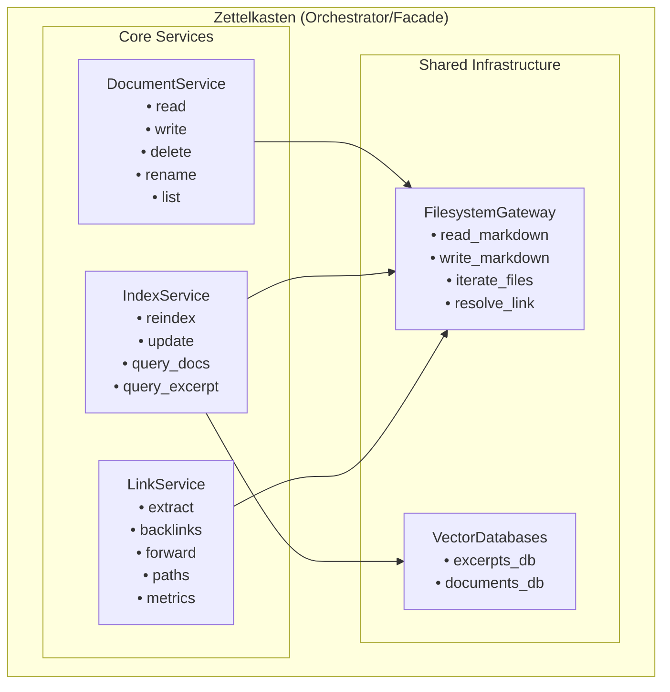

# Compositional Zettelkasten Architecture Design

## Executive Summary

The current `Zettelkasten` class has grown large and handles multiple concerns (document CRUD, vector indexing, text processing, link traversal). This document outlines a compositional refactoring approach using specialized services, starting with the `LinkTraversalService` we've just implemented.

## Current Architecture Analysis

### Current Zettelkasten Responsibilities

```python
class Zettelkasten:
    """Current monolithic structure with multiple concerns"""

    # DOCUMENT MANAGEMENT
    def read_document(self, relative_path: str) -> ZkDocument
    def create_or_overwrite_document(self, document: ZkDocument) -> None
    def create_or_append_document(self, document: ZkDocument) -> None
    def append_to_document(self, document: ZkDocument) -> None
    def rename_document(self, source_path: str, target_path: str) -> None
    def delete_document(self, relative_path: str) -> None
    def iterate_documents(self) -> Iterator[ZkDocument]

    # VECTOR INDEXING & SEARCH
    def reindex(self, excerpt_size: int, excerpt_overlap: int, progress_callback) -> None
    def update_index(self, since: datetime, excerpt_size: int, excerpt_overlap: int) -> None
    def query_excerpts(self, query: str, n_results: int, max_distance: float) -> List[ZkQueryExcerptResult]
    def query_documents(self, query: str, n_results: int, max_distance: float) -> List[ZkQueryDocumentResult]

    # INTERNAL TEXT PROCESSING
    def _index_document(self, relative_path: str, excerpt_size: int, excerpt_overlap: int) -> None
    def _split_document(self, document: ZkDocument, excerpt_size: int, excerpt_overlap: int) -> None
    def _add_document_to_index(self, document: ZkDocument) -> None
    def _add_text_excerpts_to_index(self, document: ZkDocument, text_excerpts: List[str]) -> None
```

### Issues with Current Design

1. **Single Responsibility Principle Violation**: Handles document management, indexing, and search
2. **Difficult to Test**: Large classes with many dependencies are hard to unit test
3. **Difficult to Extend**: Adding new functionality requires modifying the core class
4. **Coupling**: Changes to one concern affect others
5. **Missing Link Analysis**: No dedicated wikilink graph traversal capabilities

## Proposed Compositional Architecture

### Service-Based Architecture Overview



### Proposed Service Interfaces

#### 1. DocumentService
**Responsibility**: Pure document CRUD operations

```python
class DocumentService:
    """Handles document lifecycle operations without indexing concerns"""

    def __init__(self, filesystem_gateway: MarkdownFilesystemGateway):
        self.filesystem_gateway = filesystem_gateway

    def read_document(self, relative_path: str) -> ZkDocument
    def write_document(self, document: ZkDocument) -> None
    def delete_document(self, relative_path: str) -> None
    def rename_document(self, source_path: str, target_path: str) -> None
    def append_to_document(self, document: ZkDocument) -> None
    def list_documents(self) -> List[str]
    def iterate_documents(self) -> Iterator[ZkDocument]
    def document_exists(self, relative_path: str) -> bool

    # Metadata operations
    def update_document_metadata(self, relative_path: str, metadata: Dict[str, Any]) -> None
    def get_document_metadata(self, relative_path: str) -> Dict[str, Any]
```

#### 2. IndexService
**Responsibility**: Vector database indexing and semantic search

```python
class IndexService:
    """Handles vector indexing and semantic search operations"""

    def __init__(self,
                 tokenizer_gateway: TokenizerGateway,
                 excerpts_db: VectorDatabase,
                 documents_db: VectorDatabase,
                 document_service: DocumentService):
        self.tokenizer_gateway = tokenizer_gateway
        self.excerpts_db = excerpts_db
        self.documents_db = documents_db
        self.document_service = document_service

    def reindex_all(self, excerpt_size: int = 500, excerpt_overlap: int = 100,
                    progress_callback: Optional[ProgressCallback] = None) -> None
    def update_index(self, since: datetime, excerpt_size: int = 500,
                     excerpt_overlap: int = 100,
                     progress_callback: Optional[ProgressCallback] = None) -> None
    def index_document(self, relative_path: str, excerpt_size: int = 500,
                       excerpt_overlap: int = 100) -> None
    def remove_document_from_index(self, relative_path: str) -> None

    def query_excerpts(self, query: str, n_results: int = 8,
                       max_distance: float = 1.0) -> List[ZkQueryExcerptResult]
    def query_documents(self, query: str, n_results: int = 3,
                        max_distance: float = 0.0) -> List[ZkQueryDocumentResult]

    def get_index_stats(self) -> IndexStats
```

#### 3. LinkTraversalService (Already Implemented)
**Responsibility**: Wikilink analysis and graph traversal

```python
class LinkTraversalService:
    """Handles wikilink extraction, resolution, and graph operations"""

    # Already implemented with these capabilities:
    def extract_wikilinks_from_document(self, relative_path: str) -> List[WikiLinkReference]
    def extract_wikilinks_from_content(self, content: str, source_document: str) -> List[WikiLinkReference]
    def find_backlinks(self, target_document: str) -> List[BacklinkResult]
    def find_forward_links(self, source_document: str) -> List[ForwardLinkResult]
    def build_link_index(self) -> None
    def find_link_path(self, from_document: str, to_document: str, max_hops: int = 3) -> Optional[LinkPath]
    def get_link_metrics(self, document: Optional[str] = None) -> LinkMetrics
```

### Refactored Zettelkasten (Orchestrator)

```python
class Zettelkasten:
    """
    Orchestrator that composes specialized services to provide a unified interface.
    Maintains backward compatibility while enabling compositional architecture.
    """

    def __init__(self,
                 tokenizer_gateway: TokenizerGateway,
                 excerpts_db: VectorDatabase,
                 documents_db: VectorDatabase,
                 filesystem_gateway: MarkdownFilesystemGateway):

        # Create specialized services
        self.document_service = DocumentService(filesystem_gateway)
        self.index_service = IndexService(tokenizer_gateway, excerpts_db, documents_db, self.document_service)
        self.link_service = LinkTraversalService(filesystem_gateway)

        # Keep references for backward compatibility
        self.filesystem_gateway = filesystem_gateway
        self.tokenizer_gateway = tokenizer_gateway
        self.excerpts_db = excerpts_db
        self.documents_db = documents_db

    # Delegate document operations to DocumentService
    def read_document(self, relative_path: str) -> ZkDocument:
        return self.document_service.read_document(relative_path)

    def create_or_overwrite_document(self, document: ZkDocument) -> None:
        self.document_service.write_document(document)
        # Automatically update index
        self.index_service.index_document(document.relative_path)

    def delete_document(self, relative_path: str) -> None:
        self.document_service.delete_document(relative_path)
        # Automatically remove from index
        self.index_service.remove_document_from_index(relative_path)

    # Delegate indexing operations to IndexService
    def reindex(self, excerpt_size: int = 500, excerpt_overlap: int = 100,
                progress_callback: Optional[ProgressCallback] = None) -> None:
        return self.index_service.reindex_all(excerpt_size, excerpt_overlap, progress_callback)

    def query_excerpts(self, query: str, n_results: int = 8, max_distance: float = 1.0) -> List[ZkQueryExcerptResult]:
        return self.index_service.query_excerpts(query, n_results, max_distance)

    def query_documents(self, query: str, n_results: int = 3, max_distance: float = 0.0) -> List[ZkQueryDocumentResult]:
        return self.index_service.query_documents(query, n_results, max_distance)

    # NEW: Expose link operations through LinkService
    def extract_wikilinks(self, relative_path: str) -> List[WikiLinkReference]:
        return self.link_service.extract_wikilinks_from_document(relative_path)

    def find_backlinks(self, target_document: str) -> List[BacklinkResult]:
        return self.link_service.find_backlinks(target_document)

    def find_forward_links(self, source_document: str) -> List[ForwardLinkResult]:
        return self.link_service.find_forward_links(source_document)

    def find_link_path(self, from_document: str, to_document: str, max_hops: int = 3) -> Optional[LinkPath]:
        return self.link_service.find_link_path(from_document, to_document, max_hops)

    def get_link_metrics(self, document: Optional[str] = None) -> LinkMetrics:
        return self.link_service.get_link_metrics(document)

    def build_link_index(self) -> None:
        return self.link_service.build_link_index()
```

## Migration Strategy

### Phase 1: Service Creation (✅ Completed for LinkService)
1. ✅ Create `LinkTraversalService` with comprehensive functionality
2. ✅ Write comprehensive tests
3. ✅ Refactor existing tools to use the service
4. ✅ Maintain backward compatibility

### Phase 2: Document Service Extraction
1. Create `DocumentService` class
2. Move document CRUD operations from Zettelkasten
3. Update Zettelkasten to delegate to DocumentService
4. Update all tools to optionally use DocumentService directly

### Phase 3: Index Service Extraction
1. Create `IndexService` class
2. Move vector indexing and search operations
3. Add automatic index maintenance hooks
4. Update Zettelkasten to delegate to IndexService

### Phase 4: Integration and Optimization
1. Add cross-service coordination (e.g., auto-reindex on document changes)
2. Performance optimizations
3. Enhanced caching strategies
4. Service dependency injection for better testability

## Benefits of Compositional Architecture

### 1. Single Responsibility Principle
- Each service has one clear purpose
- Easier to understand and maintain
- Clear boundaries between concerns

### 2. Improved Testability
- Services can be tested in isolation
- Mocking is simpler with focused interfaces
- Test coverage is more granular

### 3. Enhanced Extensibility
- New functionality can be added as new services
- Services can be enhanced independently
- Plugin architecture becomes more natural

### 4. Better Performance Optimization
- Services can be optimized for their specific concerns
- Caching strategies can be service-specific
- Resource usage can be managed per service

### 5. Dependency Injection
- Services can be easily mocked or replaced
- Configuration becomes more flexible
- Testing with different implementations is easier

## Tool Integration Benefits

### Current Tool Pattern
```python
class SomeTool(LLMTool):
    def __init__(self, zk: Zettelkasten):
        self.zk = zk  # Large dependency with many concerns
```

### New Tool Pattern Options
```python
# Option 1: Service-specific dependency (preferred for focused tools)
class ExtractWikilinksFromDocument(LLMTool):
    def __init__(self, link_service: LinkTraversalService):
        self.link_service = link_service

# Option 2: Multiple service dependencies (for complex tools)
class ComprehensiveAnalysisTool(LLMTool):
    def __init__(self, document_service: DocumentService,
                 link_service: LinkTraversalService,
                 index_service: IndexService):
        self.document_service = document_service
        self.link_service = link_service
        self.index_service = index_service

# Option 3: Backward compatibility (existing tools unchanged)
class LegacyTool(LLMTool):
    def __init__(self, zk: Zettelkasten):
        self.zk = zk  # Still works, delegates to services internally
```

## Advanced Service Features

### Service Registry Pattern
```python
class ServiceRegistry:
    """Central registry for all services with dependency injection"""

    def __init__(self):
        self._services = {}

    def register(self, service_type: Type[T], instance: T) -> None:
        self._services[service_type] = instance

    def get(self, service_type: Type[T]) -> T:
        return self._services[service_type]

    def create_zettelkasten(self) -> Zettelkasten:
        return Zettelkasten(
            document_service=self.get(DocumentService),
            index_service=self.get(IndexService),
            link_service=self.get(LinkTraversalService)
        )
```

### Cross-Service Coordination
```python
class ServiceCoordinator:
    """Handles cross-service operations and maintains consistency"""

    def __init__(self, document_service: DocumentService,
                 index_service: IndexService,
                 link_service: LinkTraversalService):
        self.document_service = document_service
        self.index_service = index_service
        self.link_service = link_service

    def create_document(self, document: ZkDocument) -> None:
        """Create document with automatic index and link updates"""
        self.document_service.write_document(document)
        self.index_service.index_document(document.relative_path)
        self.link_service.build_link_index()  # Could be made incremental

    def delete_document(self, relative_path: str) -> None:
        """Delete document with cleanup of all references"""
        self.document_service.delete_document(relative_path)
        self.index_service.remove_document_from_index(relative_path)
        self.link_service.build_link_index()  # Could be made incremental
```

## Performance Considerations

### Service-Level Caching
```python
class CachedLinkTraversalService(LinkTraversalService):
    """Enhanced version with sophisticated caching"""

    def __init__(self, filesystem_gateway: MarkdownFilesystemGateway):
        super().__init__(filesystem_gateway)
        self._wikilink_cache = {}
        self._backlink_cache = {}
        self._metrics_cache = None
        self._cache_invalidation_time = {}

    def extract_wikilinks_from_document(self, relative_path: str) -> List[WikiLinkReference]:
        # Check cache first, fall back to parent implementation
        return self._cached_operation('wikilinks', relative_path,
                                      super().extract_wikilinks_from_document)
```

### Lazy Loading
```python
class LazyLoadingZettelkasten(Zettelkasten):
    """Version that creates services on-demand"""

    @property
    def link_service(self) -> LinkTraversalService:
        if not hasattr(self, '_link_service'):
            self._link_service = LinkTraversalService(self.filesystem_gateway)
        return self._link_service
```

## Conclusion

The compositional architecture provides:

1. **Clear Separation of Concerns**: Each service has a focused responsibility
2. **Improved Maintainability**: Smaller, focused classes are easier to understand and modify
3. **Enhanced Testability**: Services can be tested independently with clear interfaces
4. **Better Extensibility**: New functionality can be added as new services without modifying core classes
5. **Performance Optimization**: Service-specific optimizations and caching strategies
6. **Backward Compatibility**: Existing code continues to work through delegation

The `LinkTraversalService` we've implemented is the first step in this transformation, demonstrating how specialized services can provide focused, high-performance functionality while integrating seamlessly with the existing system.

This approach transforms zk-chat from a monolithic design into a modular, extensible platform that can grow and adapt to new requirements while maintaining the simplicity of its current interface.