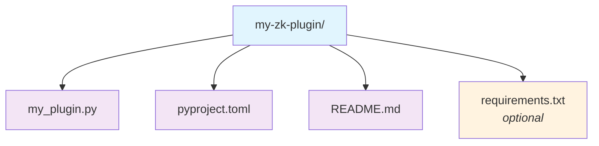

# Zk-Chat Plugin Developer Guide

This guide walks you through developing plugins for zk-chat, the command-line chat tool for your Zettelkasten. Plugins allow you to extend the chat agent with custom tools that integrate seamlessly with your knowledge base and the zk-chat runtime environment.

## Table of Contents

- [Overview](#overview)
- [Plugin Architecture](#plugin-architecture)
- [Creating Your First Plugin](#creating-your-first-plugin)
- [Available Runtime Resources](#available-runtime-resources)
- [Plugin Development Best Practices](#plugin-development-best-practices)
- [Packaging and Distribution](#packaging-and-distribution)
- [Zk-Chat Plugins vs Model Context Protocol (MCP)](#zk-chat-plugins-vs-model-context-protocol-mcp)
- [Example Plugins](#example-plugins)

## Overview

Zk-Chat plugins are tools that extend the functionality of the chat agent. They inherit from the `LLMTool` base class and are automatically discovered and loaded when zk-chat starts. Plugins have access to the same runtime environment as built-in tools, including:

- Access to the user's Zettelkasten vault
- Integration with the vector database (ChromaDB)
- LLM broker for making AI requests
- Filesystem gateway for consistent file operations
- Smart memory system for long-term context retention

## Plugin Architecture

### Core Components

1. **Plugin Discovery**: Plugins are discovered via Python entry points in the `zk_rag_plugins` group
2. **Service Provider Pattern**: Plugins receive a `ServiceProvider` that gives access to all zk-chat services
3. **Tool Interface**: All plugins must inherit from `mojentic.llm.tools.llm_tool.LLMTool` or the convenient `ZkChatPlugin` base class
4. **Automatic Loading**: The `_add_available_plugins()` function automatically loads and instantiates all discovered plugins

### Plugin Loading Mechanism

```python
def _add_available_plugins(tools, service_registry: ServiceRegistry):
    """
    Load and add available plugins to the tools list.

    Plugins are discovered via entry points and initialized with a service provider
    that gives them access to all available services in the zk-chat runtime.
    """
    eps = entry_points()
    plugin_entr_points = eps.select(group="zk_rag_plugins")
    service_provider = ServiceProvider(service_registry)

    for ep in plugin_entr_points:
        logging.info(f"Adding Plugin {ep.name}")
        plugin_class = ep.load()
        # Plugins now receive a service provider instead of individual parameters
        tools.append(plugin_class(service_provider))
```

All plugins are instantiated with:
- `service_provider`: A `ServiceProvider` instance that provides access to all available zk-chat services

### Service Registry Architecture

The new service registry architecture provides a scalable way for plugins to access services without requiring changes to plugin constructors as new services are added. Services are registered by type and can be requested by plugins as needed.

Available service types include:
- **Core Services**: Filesystem gateway, LLM broker, Zettelkasten, Smart Memory
- **Database Services**: ChromaDB gateway, Vector database
- **Gateway Services**: Model gateway (Ollama/OpenAI), Tokenizer gateway
- **Optional Services**: Git gateway (when enabled)
- **Configuration**: Application config

## Creating Your First Plugin

### Step 1: Set Up Your Plugin Package

Create a new Python package for your plugin:

```bash
mkdir my-zk-plugin
cd my-zk-plugin
```

### Step 2: Create the Plugin Class

Create your main plugin file (e.g., `my_plugin.py`):

```python
"""
Simple example plugin for zk-chat demonstrating the new service provider interface.
This can be used as a template for creating your own plugins.
"""
import structlog
from zk_chat.services import ZkChatPlugin, ServiceProvider

logger = structlog.get_logger()


class MyCustomTool(ZkChatPlugin):
    """A custom tool for zk-chat that demonstrates the plugin interface."""

    def __init__(self, service_provider: ServiceProvider):
        """Initialize the plugin with a service provider.

        The service provider gives access to all zk-chat services:
        - Filesystem gateway for file operations
        - LLM broker for AI requests
        - Zettelkasten for document operations
        - Smart Memory for long-term context
        - Configuration and other services

        Args:
            service_provider: Service provider for accessing zk-chat services
        """
        super().__init__(service_provider)
        logger.info("Initialized MyCustomTool plugin")

    def run(self, user_input: str) -> str:
        """Execute the plugin's main functionality.

        Args:
            user_input: Input from the user

        Returns:
            str: Result to be returned to the chat
        """
        logger.info("Running MyCustomTool", user_input=user_input)

        # Access services through convenient properties
        vault_path = self.vault_path
        filesystem = self.filesystem_gateway
        llm = self.llm_broker
        zk = self.zettelkasten

        # Example: Read a document from the vault
        if filesystem and filesystem.path_exists("README.md"):
            content = filesystem.read_file("README.md")
            logger.info("Read README.md", content_length=len(content))

        # Your plugin logic here
        result = f"Processed: {user_input} in vault: {vault_path}"

        return result

    @property
    def descriptor(self) -> dict:
        """Return the OpenAI function descriptor for this tool.

        This descriptor tells the LLM how to use your tool, including:
        - Function name and description
        - Parameters and their types
        - Required parameters
        """
        return {
            "type": "function",
            "function": {
                "name": "my_custom_tool",
                "description": "A demonstration tool that processes user input with access to the vault and services",
                "parameters": {
                    "type": "object",
                    "properties": {
                        "user_input": {
                            "type": "string",
                            "description": "The input text to process"
                        }
                    },
                    "required": ["user_input"]
                }
            }
        }
```

#### Alternative: Direct LLMTool Inheritance

If you prefer more control or don't want to use the convenience base class, you can inherit directly from `LLMTool`:

```python
from mojentic.llm.tools.llm_tool import LLMTool
from zk_chat.services import ServiceProvider

class MyCustomTool(LLMTool):
    def __init__(self, service_provider: ServiceProvider):
        super().__init__()
        self.service_provider = service_provider

    def run(self, user_input: str) -> str:
        # Access services manually
        filesystem = self.service_provider.get_filesystem_gateway()
        llm = self.service_provider.get_llm_broker()
        config = self.service_provider.get_config()

        # Your plugin logic here
        return f"Processed: {user_input}"
```

### Step 3: Configure Entry Points

Create a `pyproject.toml` file to register your plugin:

```toml
[project]
name = "my-zk-plugin"
version = "1.0.0"
description = "My custom Zk-Chat plugin"
requires-python = ">=3.11"
dependencies = [
    "mojentic>=0.6.1",
]

[build-system]
requires = ["setuptools>=61.0.0", "wheel"]
build-backend = "setuptools.build_meta"

[project.entry-points]
zk_rag_plugins = { my_plugin = "my_plugin:MyCustomTool" }

[tool.setuptools]
py-modules = ["my_plugin"]
```

### Step 4: Install and Test

Install your plugin in development mode:

```bash
pip install -e .
```

Now your plugin will be automatically loaded when you run zk-chat!

## Migration from Legacy Plugin Interface

If you have existing plugins that use the old interface (`vault: str, llm: LLMBroker`), you need to update them to use the new service provider pattern:

### Before (Legacy)
```python
class MyPlugin(LLMTool):
    def __init__(self, vault: str, llm: LLMBroker):
        super().__init__()
        self.vault = vault
        self.llm = llm
```

### After (New Service Provider)
```python
from zk_chat.services import ZkChatPlugin, ServiceProvider

class MyPlugin(ZkChatPlugin):
    def __init__(self, service_provider: ServiceProvider):
        super().__init__(service_provider)

        # Access services through properties
        # self.vault_path replaces self.vault
        # self.llm_broker replaces self.llm
```

### Migration Benefits

The new architecture provides several advantages:
- **Extensible**: New services can be added without changing plugin constructors
- **Type-safe**: Better IDE support and error detection
- **Consistent**: All plugins use the same service access pattern
- **Feature-rich**: Access to all zk-chat services, not just vault and LLM

## Available Runtime Resources

Plugins have access to the full zk-chat runtime environment through the service provider pattern. The new architecture provides a clean, extensible way to access services without requiring changes to plugin constructors as new services are added.

### Service Provider Pattern

The `ServiceProvider` gives plugins access to all available services:

```python
from zk_chat.services import ServiceProvider, ServiceType

def __init__(self, service_provider: ServiceProvider):
    super().__init__(service_provider)

    # Access services through convenient methods
    filesystem = service_provider.get_filesystem_gateway()
    llm = service_provider.get_llm_broker()
    zk = service_provider.get_zettelkasten()
    smart_memory = service_provider.get_smart_memory()

    # Or use the base class properties
    self.filesystem_gateway  # Convenient property access
    self.llm_broker
    self.zettelkasten
    self.smart_memory
```

### Available Services

#### 1. Filesystem Gateway
- **Purpose**: Consistent filesystem operations integrated with zk-chat's document handling
- **Usage**: Read, create, and modify documents with proper abstractions
- **Access**: `service_provider.get_filesystem_gateway()` or `self.filesystem_gateway`

```python
def process_document(self, relative_path: str) -> str:
    """Process a document using the filesystem gateway."""
    fs = self.filesystem_gateway

    if fs.path_exists(relative_path):
        content = fs.read_file(relative_path)
        # Process content...
        fs.write_file(relative_path, processed_content)
        return "Document processed"
    return "Document not found"
```

#### 2. LLM Broker
- **Purpose**: Make requests to the configured LLM
- **Usage**: Generate text, analyze content, create summaries
- **Access**: `service_provider.get_llm_broker()` or `self.llm_broker`

```python
def analyze_text(self, text: str) -> str:
    """Use the LLM to analyze text."""
    llm = self.llm_broker
    prompt = f"Analyze this text and provide insights: {text}"
    return llm.send(prompt)
```

#### 3. Zettelkasten Service
- **Purpose**: High-level document operations with indexing and search
- **Usage**: Document CRUD operations, semantic search, wikilink resolution
- **Access**: `service_provider.get_zettelkasten()` or `self.zettelkasten`

```python
def find_related_documents(self, query: str) -> str:
    """Find documents related to a query."""
    zk = self.zettelkasten
    results = zk.find_documents_related_to(query)
    return f"Found {len(results)} related documents"
```

#### 4. Smart Memory
- **Purpose**: Long-term context retention across chat sessions
- **Usage**: Store and retrieve important information for personalized responses
- **Access**: `service_provider.get_smart_memory()` or `self.smart_memory`

```python
def remember_user_preference(self, preference: str) -> str:
    """Store a user preference in smart memory."""
    memory = self.smart_memory
    memory.store(f"User preference: {preference}")
    return "Preference stored in memory"
```

#### 5. ChromaDB Gateway
- **Purpose**: Direct access to vector database operations
- **Usage**: Custom vector operations, collection management
- **Access**: `service_provider.get_chroma_gateway()` or `self.chroma_gateway`

```python
def custom_vector_search(self, query: str) -> str:
    """Perform custom vector search."""
    chroma = self.chroma_gateway
    # Perform custom vector operations...
    return "Search completed"
```

#### 6. Model Gateway
- **Purpose**: Direct access to the underlying LLM gateway (Ollama/OpenAI)
- **Usage**: Low-level LLM operations, embeddings, custom model calls
- **Access**: `service_provider.get_model_gateway()` or `self.model_gateway`

```python
def get_embeddings(self, text: str) -> list:
    """Get embeddings for text."""
    gateway = self.model_gateway
    return gateway.calculate_embeddings(text)
```

#### 7. Configuration Access
- **Purpose**: Access to application configuration
- **Usage**: Get vault path, model settings, and other configuration values
- **Access**: `service_provider.get_config()` or `self.config`

```python
def get_vault_info(self) -> str:
    """Get information about the current vault."""
    config = self.config
    return f"Vault path: {config.vault}, Model: {config.model}"
```

#### 8. Git Gateway (Optional)
- **Purpose**: Git operations when git integration is enabled
- **Usage**: Commit changes, view git status
- **Access**: `service_provider.get_git_gateway()` or `self.git_gateway`

```python
def commit_changes(self, message: str) -> str:
    """Commit changes if git is available."""
    git = self.git_gateway
    if git:
        git.commit(message)
        return "Changes committed"
    return "Git not available"
```

### Service Availability

Not all services may be available in every context. Use the service provider to check availability:

```python
from zk_chat.services import ServiceType

def check_services(self):
    """Check what services are available."""
    provider = self.service_provider

    if provider.has_service(ServiceType.GIT_GATEWAY):
        # Git operations are available
        git = provider.get_git_gateway()

    # Or require a service (raises exception if not available)
    try:
        required_service = provider.require_service(ServiceType.SMART_MEMORY)
    except RuntimeError as e:
        return f"Required service not available: {e}"
```

## Plugin Development Best Practices

### 1. Error Handling
Always handle errors gracefully and return meaningful error messages:

```python
def run(self, input_data: str) -> str:
    try:
        # Plugin logic here
        return result
    except Exception as e:
        logger.error("Plugin error", error=str(e))
        return f"Error in plugin: {str(e)}"
```

### 2. Input Validation
Validate inputs and provide clear feedback:

```python
def run(self, file_path: str) -> str:
    if not file_path:
        return "Error: file_path parameter is required"

    if not file_path.endswith('.md'):
        return "Error: Only markdown files are supported"

    # Continue with plugin logic...
```

### 3. Descriptive Function Descriptors
Make your tool easy for the LLM to understand and use:

```python
@property
def descriptor(self) -> dict:
    return {
        "type": "function",
        "function": {
            "name": "generate_summary",
            "description": "Generate a concise summary of a document from the Zettelkasten. Use this when the user asks for a summary of a specific document.",
            "parameters": {
                "type": "object",
                "properties": {
                    "document_path": {
                        "type": "string",
                        "description": "The relative path to the document within the Zettelkasten (e.g., 'notes/research.md')"
                    },
                    "max_length": {
                        "type": "integer",
                        "description": "Maximum length of the summary in words (default: 100)",
                        "default": 100
                    }
                },
                "required": ["document_path"]
            }
        }
    }
```

### 4. Use Structured Logging
Include relevant context in your log messages:

```python
logger.info(
    "Generated summary",
    document_path=document_path,
    original_length=len(content),
    summary_length=len(summary)
)
```

## Packaging and Distribution

### 1. Package Structure


### 2. Publishing to PyPI
```bash
pip install build twine
python -m build
twine upload dist/*
```

### 3. Installation by Users
Users can install your plugin with:

```bash
# Using pipx (recommended)
pipx inject zk-chat my-zk-plugin

# Using pip in a virtual environment
pip install my-zk-plugin
```

## Zk-Chat Plugins vs Model Context Protocol (MCP)

### Zk-Chat Plugins Advantages

**🔧 Deep Runtime Integration**
- Direct access to the user's Zettelkasten vault
- Integration with zk-chat's vector database and Smart Memory
- Access to the same LLM broker used by the system
- Consistent filesystem operations via the filesystem gateway

**📊 Shared Context**
- Plugins operate within the same chat session context
- Access to conversation history and system state
- Seamless integration with other tools and plugins

**🚀 Performance Benefits**
- No inter-process communication overhead
- Direct memory access to shared resources
- Faster execution for file operations and database queries

**🛠️ Developer Experience**
- Simple Python class inheritance model
- Automatic discovery and loading
- Rich runtime environment with logging, error handling, and utilities

### MCP Advantages

**🔒 Isolation**
- Complete separation from the host application
- Independent deployment and updates
- Better security boundaries

**🌐 Language Agnostic**
- Can be implemented in any programming language
- Standardized protocol across different AI systems
- Greater portability between different chat systems

**⚡ Independent Operation**
- Plugins can run on separate machines
- Scalable architecture for resource-intensive operations
- Independent failure domains

### When to Choose Zk-Chat Plugins

Choose zk-chat plugins when you need:

- **Deep integration** with the Zettelkasten and its metadata
- **Access to the vector database** for semantic search capabilities
- **Consistent file operations** that align with zk-chat's document handling
- **Shared context** with other tools in the chat session
- **Simple development** with Python and familiar object-oriented patterns
- **Performance-critical operations** that benefit from direct memory access
- **Access to Smart Memory** for long-term context retention across sessions

### When to Choose MCP

Choose MCP when you need:

- **Language flexibility** (non-Python implementations)
- **Strong isolation** from the host system
- **Independent deployment** and scaling
- **Cross-platform compatibility** with multiple AI systems
- **Resource-intensive operations** that benefit from separate processes

### MCP Integration in Zk-Chat

Note that zk-chat also includes built-in MCP server functionality (`zk_chat/mcp.py`) that exposes specific zk-chat tools via the Model Context Protocol. This allows external MCP clients to access zk-chat's document and memory capabilities independently. However, this is primarily intended for integration with other AI systems rather than extending zk-chat's own functionality.

## Example Plugins

### 1. Updated Wikipedia Lookup Plugin

Here's how the Wikipedia plugin would look with the new service provider architecture:

```python
from pathlib import Path
from typing import Optional

import wikipedia
from mojentic.llm.tools.llm_tool import LLMTool
from pydantic import BaseModel
from wikipedia import DisambiguationError

from zk_chat.services import ServiceProvider


class WikipediaContentResult(BaseModel):
    title: str
    content: str
    url: Optional[str]


class LookUpTopicOnWikipedia(LLMTool):
    """Tool for retrieving content from Wikipedia for a given entity."""

    def __init__(self, service_provider: ServiceProvider):
        """Initialize the tool with service provider."""
        super().__init__()
        self.service_provider = service_provider

    def run(self, topic: str) -> str:
        try:
            # Search for the page
            search_results = wikipedia.search(topic)
            if not search_results:
                return WikipediaContentResult(
                    title="No results",
                    content=f"No Wikipedia articles found for '{topic}'",
                    url=None
                ).model_dump()

            # Get the top result
            page_title = search_results[0]
            page = wikipedia.page(page_title, auto_suggest=False)

            return WikipediaContentResult(
                title=page.title,
                content=page.summary,
                url=page.url
            ).model_dump()

        except wikipedia.DisambiguationError as e:
            # Handle disambiguation pages by taking the first option
            try:
                page = wikipedia.page(e.options[0], auto_suggest=False)
                return WikipediaContentResult(
                    title=page.title,
                    content=page.summary,
                    url=page.url
                ).model_dump()
            except DisambiguationError:
                return WikipediaContentResult(
                    title="Disambiguation Error",
                    content=f"Multiple matches found for '{topic}'. Please be more specific.",
                    url=None
                ).model_dump()
        except Exception as e:
            return WikipediaContentResult(
                title="Error",
                content=f"An error occurred while retrieving Wikipedia content: {str(e)}",
                url=None
            ).model_dump()

    @property
    def descriptor(self) -> dict:
        return {
            "type": "function",
            "function": {
                "name": "lookup_topic_on_wikipedia",
                "description": "Retrieves information about a given topic from Wikipedia.",
                "parameters": {
                    "type": "object",
                    "properties": {
                        "topic": {
                            "type": "string",
                            "description": "The topic I'd like to learn about."
                        }
                    },
                    "required": ["topic"]
                }
            }
        }
```

### 2. Updated Image Generator Plugin

Here's how the image generator plugin would look with service provider access:

```python
from pathlib import Path
from typing import Optional

from zk_chat.services import ZkChatPlugin, ServiceProvider
from stable_diffusion_gateway import StableDiffusionGateway


class GenerateImage(ZkChatPlugin):
    """Tool to generate images from a description using the StableDiffusion 3.5 Medium model."""

    def __init__(self, service_provider: ServiceProvider, gateway: Optional[StableDiffusionGateway] = None):
        """Initialize the tool with service provider."""
        super().__init__(service_provider)
        self.gateway = gateway or StableDiffusionGateway()

    def run(self, image_description: str, base_filename: str) -> str:
        """Generate an image based on the description and save it to a file.

        Parameters
        ----------
        image_description : str
            The text description of the image to generate
        base_filename : str
            The base name for the output file (without extension)

        Returns
        -------
        str
            The filename relative to the vault path
        """
        # Use the service provider to get the vault path
        vault_path = self.vault_path
        if not vault_path:
            return "Error: Vault path not available"

        filename = Path(vault_path) / f"{base_filename}.png"
        image = self.gateway.generate_image(image_description)
        image.save(filename)

        return f"""
The image has been generated and saved at `{base_filename}.png`.
You can embed it in your markdown file using the following syntax: ``
""".strip()

    @property
    def descriptor(self) -> dict:
        return {
            "type": "function",
            "function": {
                "name": "generate_image",
                "description": "Generates a PNG image from a description using the StableDiffusion 3.5 Medium model.",
                "parameters": {
                    "type": "object",
                    "properties": {
                        "image_description": {
                            "type": "string",
                            "description": "A detailed description of the image you wish to generate."
                        },
                        "base_filename": {
                            "type": "string",
                            "description": "The filename to save the generated image as, without the PNG extension."
                        }
                    },
                    "required": ["image_description"]
                }
            }
        }
```

### 3. Advanced Plugin Using Multiple Services

Here's an example of a plugin that leverages multiple services:

```python
from zk_chat.services import ZkChatPlugin, ServiceProvider, ServiceType


class AdvancedAnalysisPlugin(ZkChatPlugin):
    """Plugin that demonstrates using multiple services together."""

    def __init__(self, service_provider: ServiceProvider):
        super().__init__(service_provider)

    def run(self, document_path: str, analysis_type: str) -> str:
        """Analyze a document using multiple zk-chat services."""

        # Check if required services are available
        if not self.has_service(ServiceType.ZETTELKASTEN):
            return "Error: Zettelkasten service not available"

        # Read the document
        zk = self.zettelkasten
        if not zk.document_exists(document_path):
            return f"Document not found: {document_path}"

        document = zk.read_document(document_path)

        # Use LLM for analysis
        llm = self.llm_broker
        analysis_prompt = f"""
        Analyze this document for: {analysis_type}

        Document content:
        {document.content}

        Provide a detailed analysis focusing on the requested aspect.
        """

        analysis_result = llm.send(analysis_prompt)

        # Store the analysis in smart memory for future reference
        if self.smart_memory:
            memory_entry = f"Analysis of {document_path} for {analysis_type}: {analysis_result}"
            self.smart_memory.store(memory_entry)

        # Find related documents
        related_docs = zk.find_documents_related_to(analysis_result)

        result = f"""
## Analysis Result

{analysis_result}

## Related Documents

Found {len(related_docs)} related documents:
{', '.join([doc.relative_path for doc in related_docs[:5]])}

Analysis has been stored in smart memory for future reference.
"""

        return result

    @property
    def descriptor(self) -> dict:
        return {
            "type": "function",
            "function": {
                "name": "advanced_document_analysis",
                "description": "Perform advanced analysis of a document using multiple zk-chat services.",
                "parameters": {
                    "type": "object",
                    "properties": {
                        "document_path": {
                            "type": "string",
                            "description": "Path to the document to analyze"
                        },
                        "analysis_type": {
                            "type": "string",
                            "description": "Type of analysis to perform (e.g., 'themes', 'arguments', 'key_concepts')"
                        }
                    },
                    "required": ["document_path", "analysis_type"]
                }
            }
        }
```

## Getting Help

- **Issues**: Report bugs or feature requests on the [zk-chat GitHub repository](https://github.com/svetzal/zk-chat/issues)
- **Discussions**: Ask questions in the [GitHub Discussions](https://github.com/svetzal/zk-chat/discussions)
- **Example Code**: Check out the existing plugin repositories for inspiration

Happy plugin development! 🚀